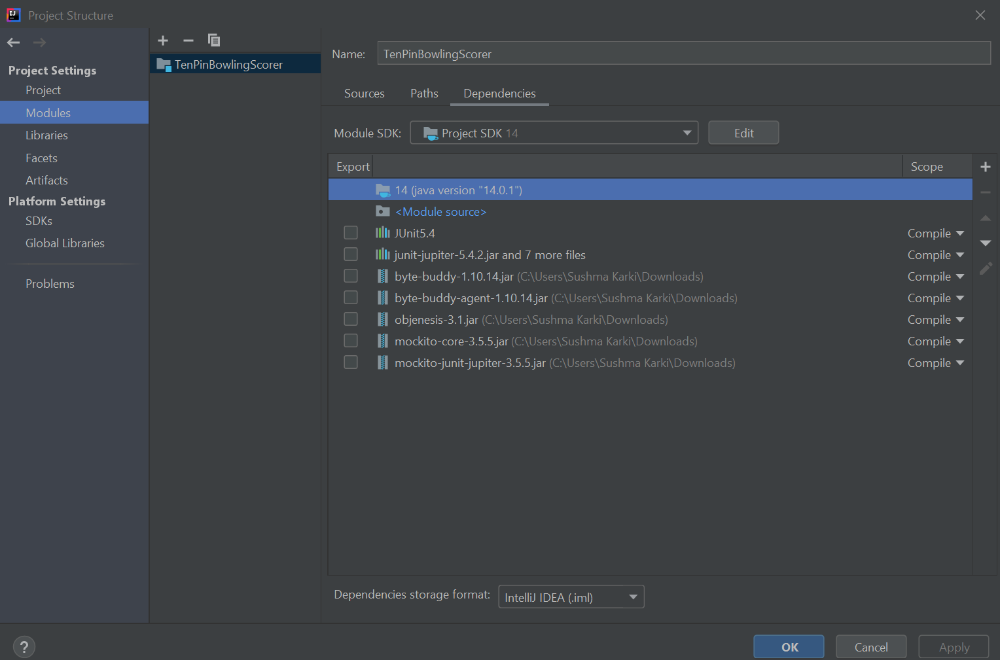
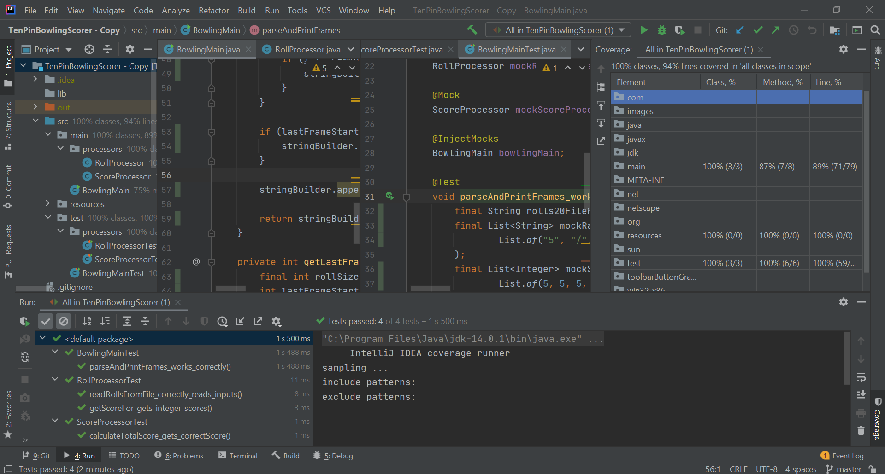

## Ten Pin Bowling Scoring Application

- This application allows you to calculate the correct, total score of 10-pin bowling
- The app takes the path to a file with comma-separated list of scores for each rolls
- One roll is basically one throw or one try. A frame represents a single round of the game. There are 10 total frames.
- For detailed scoring rules, visit: https://www.topendsports.com/sport/tenpin/scoring.htm .

### About the Application

__App Structure__

- The application's project consists of a src folder that contains a main folder (containing the actual code) and a test 
folder (containing the corresponding unit tests). Also, a resource folder is present which contains in our case all the 
text files with comma-separated list of rolls
- The entry point of the application is the class BowlingMain. 
- Corresponding unit tests are provided for various scenarios for all the public methods in all the classes. 

__Packages and Dependencies__
- The application is using JUnit5 as the testing framework. It also uses mockito for mocking and stubbing purposes. 
- The version of mockito with its dependencies can be found at https://mvnrepository.com/artifact/org.mockito/mockito-core/3.5.5.
Also, mockito-junit package can be found at https://mvnrepository.com/artifact/org.mockito/mockito-junit-jupiter/3.5.5.
If not using Maven or gradle, download the jar versions of mockito and its dependencies. Add these to the project jars. 
- A possible improvement could be converting this into a Maven project thereby removing 
the necessity to manage dependencies manually.  

__Coding Environment__
- IDE/Editor Specifications: 
>  IntelliJ IDEA 2020.2 (Community Edition)  
   Build #IC-202.6397.94, built on July 27, 2020  
   Runtime version: 11.0.7+10-b944.20 amd64  
   VM: OpenJDK 64-Bit Server VM by JetBrains s.r.o. 
   Windows 10 10.0  
   GC: ParNew, ConcurrentMarkSweep  
   Memory: 970M  
   Cores: 8  
   Non-Bundled Plugins: org.jetbrains.kotlin  
- Java/Runtime Specifications:
> Java               : 14  
  JVM vendor name    : Oracle Corporation  
  JVM vendor version : 14.0.1+7  
  JVM name           : OpenJDK 64-Bit Server VM  
  JVM version        : 14.0.1+7  
  JVM info           : mixed mode, sharing  
  OS name            : Windows 10  
  OS version         : 10.0  

### Screenshots

- First screenshot is the project setup in my own local machine (Windows 10, Java 14 and IntelliJ). Please check:

- Second screenshot is the result of running all the tests with default Intellij Coverage in my local machine. Please check:
 